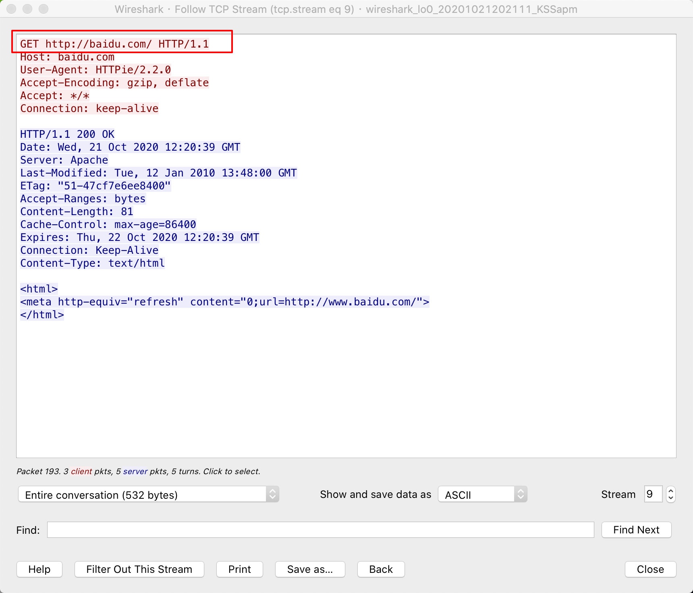
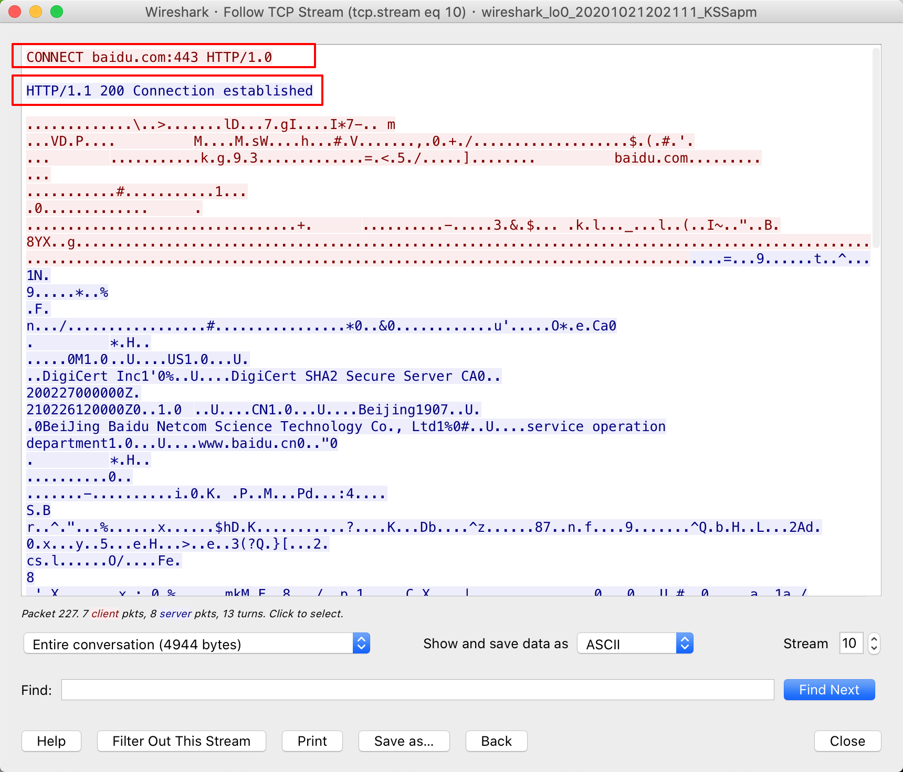

# go-httpproxy
A simple http proxy, support HTTP/HTTPS/HTTP2/Websocket.

# Example
```
// simple proxy
httpproxy -p 1087

// proxy with socks5
httpproxy --proxy socks5://your-host:1080 -p 1087
```

# Proxy Protocol Screenshoot
## for HTTP


## for HTTPS


# Refers
- [HTTP 代理原理及实现（一）](https://imququ.com/post/web-proxy.html)
